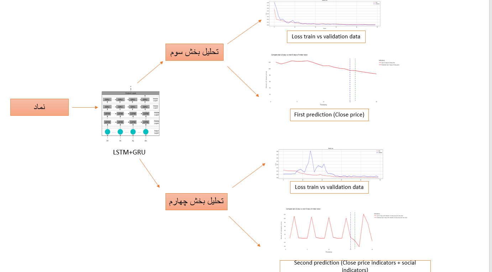

# The effect of the combination of economic and social analysis on the prediction of stock price fluctuations

## Decription:

In the first phase, a general study was conducted on technical analysis, types of candles and types of indicators, etc., in various sources, including the introduced Telegram address. In the second phase, social data was received from the hashtag site in the form of two Excel files and a Hashtag site for every 10 symbols, which Hashtag file was used for the graphic analysis of Telegram channels for 10 symbols, which can be seen in the second phase of the project. Next, in the third phase, economic and financial data were downloaded by Docker from [tsetms Pages](https://www.tsetmc.com/), then after several stages of coding for editing, the important columns of this data, along with the obtained indicators, were received for all 10 symbols and are transferred to the fourth phase.

## Result:
In the last phase and the fourth phase, we will have two types of predictions using recurrent neural networks, in the first prediction, we predict the stock market price from the tables of the third phase, and in the second prediction, from the combination of the indicators of the tables of the second phase and Third, we use it to predict the price. In fact, we enter social data into the prediction.

